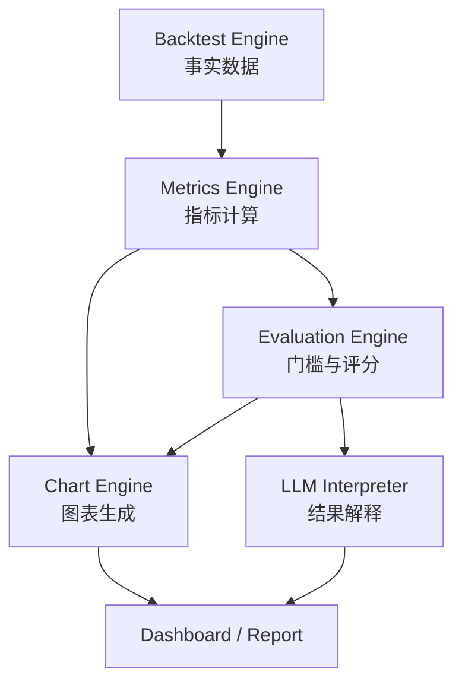

# 策略回测评价流水线文档总览

> 文档版本：v1.0  
> 流程：`Backtest Engine → Metrics Engine → Evaluation Engine → Chart Engine → LLM Interpreter`

## 1. 目标

本套文档用于定义固定策略回测结束后的评价与展示流程，使事实数据、指标计算、规则评分、图表渲染和自然语言解释相互解耦。

核心约束：

- Backtest Engine 只产生事实，不评价策略好坏。
- Metrics Engine 只按固定公式计算指标，不输出主观结论。
- Evaluation Engine 先执行可信度门槛，再按固定规则评分。
- Chart Engine 只消费标准图表数据，不重新计算核心指标。
- LLM 只能解释已经产生的事实、评分和警告，不修改数值与评级。

## 2. 总体架构



## 3. 文档清单

| 文档 | 主要职责 | 核心输出 |
|---|---|---|
| `evaluation_pipeline_overview.md` | 定义全流程、边界和依赖关系 | 文档地图 |
| `backtest_fact_contract.md` | 定义回测引擎必须输出的原始事实 | `BacktestFacts` |
| `backtest_metrics.md` | 定义指标名称、公式与图表底层字段 | `BacktestMetrics` |
| `metrics_engine_design.md` | 定义指标引擎模块、计算顺序与接口 | `MetricsResult` |
| `evaluation_engine_design.md` | 定义可信度门槛、维度评分和评级 | `StrategyAssessment` |
| `chart_engine_design.md` | 定义图表注册表、输入字段和渲染接口 | `ChartBundle` |
| `llm_result_interpreter_design.md` | 定义 LLM 可解释内容、证据引用和禁区 | `InterpretationResult` |
| `evaluation_pipeline_testing.md` | 定义单元、契约、回归和端到端测试 | 测试与验收标准 |

已有的 `strategy_compiler_design.md` 位于本流程上游，负责从自然语言生成确定性的 `ExecutionPlan`。

## 4. 模块职责边界

| 模块 | 负责 | 不负责 |
|---|---|---|
| Backtest Engine | 撮合、持仓、现金、订单、成交、成本、净值 | 计算最终策略评级 |
| Metrics Engine | 收益、风险、稳定性、交易和归因指标 | 改写回测事实 |
| Evaluation Engine | 可信度检查、维度评分、评级、警告 | 画图或生成投资建议 |
| Chart Engine | 图表数据转换、样式和渲染 | 自行改变指标口径 |
| LLM Interpreter | 用自然语言解释事实与规则结论 | 自行计算、猜测或调整分数 |

## 5. 标准对象关系

```text
ExecutionPlan
    ↓
BacktestFacts
    ↓
MetricsResult
    ├── SummaryMetrics
    ├── MetricSeries
    └── MetricWarnings
          ↓
StrategyAssessment
    ├── ValidityResult
    ├── DimensionScores
    ├── Rating
    └── EvidenceRefs
          ↓
ChartBundle + InterpretationResult
          ↓
Dashboard / HTML / Markdown / API JSON
```

## 6. 推荐调用顺序

```python
facts = backtest_engine.run(execution_plan)

metrics = metrics_engine.calculate(facts)

assessment = evaluation_engine.evaluate(
    facts=facts,
    metrics=metrics,
    profile="cn_long_only_equity",
)

charts = chart_engine.render(
    facts=facts,
    metrics=metrics,
    assessment=assessment,
)

interpretation = llm_interpreter.explain(
    facts=facts.metadata,
    metrics=metrics.summary,
    assessment=assessment,
)

report = report_builder.build(
    facts=facts,
    metrics=metrics,
    assessment=assessment,
    charts=charts,
    interpretation=interpretation,
)
```

## 7. 版本管理

最终结果至少记录：

| 字段 | 说明 |
|---|---|
| `strategy_hash` | 规范化策略及规则版本生成的 Hash |
| `data_version` | 行情和财务数据版本 |
| `engine_version` | 回测引擎版本 |
| `metrics_version` | 指标公式版本 |
| `evaluation_profile_version` | 评分配置版本 |
| `chart_schema_version` | 图表数据协议版本 |
| `interpreter_prompt_version` | LLM 解读提示词版本 |

LLM 模型或提示词变化不得改变事实、指标与评分，只允许影响表达方式。

## 8. 失败策略

| 阶段 | 失败时行为 |
|---|---|
| Backtest Engine | 返回失败状态，不进入指标计算 |
| Metrics Engine | 保留可计算指标，无法计算项为 `null` 并附警告 |
| Validity Gate | 标记 `invalid_backtest`，禁止生成策略优劣评级 |
| Evaluation Engine | 单维度无法评分时标记 `not_scored`，不以 0 分替代 |
| Chart Engine | 单图失败不阻塞其他图表，返回图表级错误 |
| LLM Interpreter | 失败时仍返回结构化指标、评分和图表 |

## 9. 第一版实施顺序

1. 固定 `BacktestFacts` Schema。
2. 完成 P0 Metrics 与公式测试。
3. 实现 Validity Gate。
4. 实现评分配置与 `StrategyAssessment`。
5. 实现 P0 Plotly 图表。
6. 接入受约束的 LLM Interpreter。
7. 完成端到端 Golden Case。

## 10. 总体验收标准

- 各模块只能通过版本化 Schema 交换数据。
- 指标能够从事实数据独立复算。
- 图表不承担核心金融指标计算。
- 评分规则不包含 LLM 判断。
- 无效回测不会产生误导性评级。
- LLM 输出中的每个数值和结论均能追溯至结构化字段。
- 相同输入与版本产生相同事实、指标、评分和图表数据。

