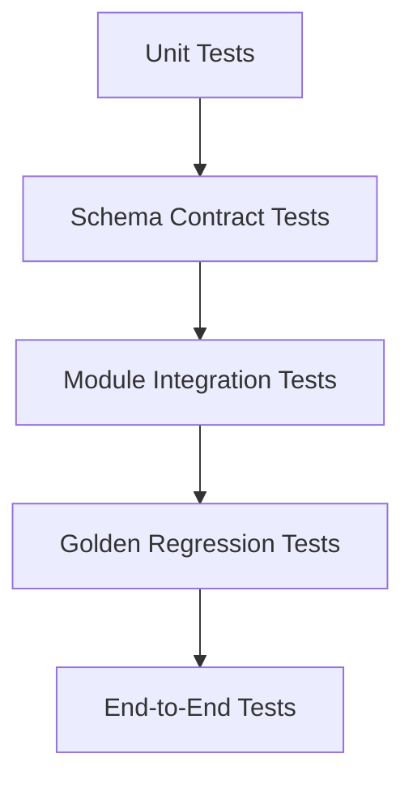

# 策略评价流水线测试与验收规范

> 文档版本：v1.0  
> 覆盖：Backtest Facts、Metrics、Evaluation、Charts、LLM Interpreter

## 1. 测试目标

验证整条流水线满足：

- 正确性：公式、评分和图表数据符合协议。
- 确定性：相同输入与版本得到相同结果。
- 可追溯性：结论可以追溯至事实、指标和规则。
- 鲁棒性：缺失值、异常数据和局部失败得到明确处理。
- 防误导：无效回测不会被评为优秀策略。

## 2. 测试分层



## 3. Backtest Facts 测试

### 3.1 Schema

- 所有必填字段存在。
- 日期、枚举、金额和比例类型正确。
- 禁止 `NaN`、`Infinity`。
- 日期和事件按照时间排序。
- ID 在相应作用域内唯一。

### 3.2 会计不变量

```text
net_portfolio_value = cash + positions_value
sum(position_weights) + cash_ratio ≈ 1
filled_quantity <= requested_quantity
total_cost ≈ sum(cost_components)
```

### 3.3 订单与成交

- 每个 Fill 都能找到对应 Order。
- 拒单和延期订单必须带原因。
- 涨停买入、跌停卖出和停牌按政策执行。
- 部分成交不会被记录为全额成交。

### 3.4 时间边界

- 收盘产生的信号不得在同一收盘价成交。
- 财务因子不得早于公告时间使用。
- 调仓事件只能发生在有效交易日。

## 4. Metrics Engine 单元测试

### 4.1 手工可验证序列

使用短序列测试：

```text
returns = [0.10, -0.05, 0.02]
nav = [1.10, 1.045, 1.0659]
```

验证：

- 净值累计。
- 总收益。
- 历史峰值。
- 回撤序列。
- 最大回撤。

### 4.2 边界条件

| 场景 | 期望 |
|---|---|
| 空收益序列 | 指标为 `null` 或空序列并附警告 |
| 只有一个样本 | 波动率和 Sharpe 为 `null` |
| 零波动正收益 | Sharpe 为 `null`，不输出 Infinity |
| 单日亏损 100% | 标记破产或严重异常 |
| 基准零方差 | Beta 为 `null` |
| 无交易 | 成本和换手为 0，交易胜率为 `null` |

### 4.3 公式对照

- 使用独立 NumPy 实现进行交叉验证。
- 可使用 QuantStats 作为辅助对照，但内部协议为标准答案。
- 明确容差，例如绝对误差 `< 1e-10`。

## 5. Evaluation Engine 测试

### 5.1 Validity Gate

每条硬规则至少包含一个失败样例：

```text
未来函数                → invalid_backtest
严重生存者偏差          → invalid_backtest
高换手但未计算成本      → invalid_backtest
净值无法从收益复算      → invalid_backtest
```

### 5.2 评分插值

测试：

- 评分节点值。
- 节点之间的线性插值。
- 超过上下界时截断。
- 越高越好和越低越好两种方向。
- 缺失指标后的权重重新归一化。

### 5.3 权重

```text
sum(dimension_weights) = 1
sum(metric_weights_within_dimension) = 1
```

允许浮点误差，但不得静默使用未归一化权重。

### 5.4 评级边界

验证评级区间边界：

```text
89.999 → B
90.000 → A
```

具体包含关系由 Profile 明确定义。

### 5.5 可追溯性

每个优势、弱点和警告必须包含：

```text
conclusion_id
rule_id
metric_refs
```

## 6. Chart Engine 测试

### 6.1 数据测试

- 图表 Builder 声明的必填字段存在。
- 日期排序稳定。
- 月度热力图的行列对应正确。
- 净值图的终值与 Summary 一致。
- 最大回撤注释日期与 Metrics 一致。
- 图表百分比格式不会改变原值。

### 6.2 Snapshot 测试

对于稳定的静态输出，可以执行图像快照测试：

- 固定字体、尺寸、主题和渲染版本。
- 允许小范围像素差异。
- 图像快照只验证渲染，不替代数据断言。

### 6.3 空状态

- 空数据返回 `empty`。
- 缺字段返回 `invalid_input`。
- 单图失败不影响其他图表。
- 无效回测图表带明显警示状态。

## 7. LLM Interpreter 测试

### 7.1 Schema

- 输出符合 `InterpretationResult`。
- 所有 `evidence_refs` 存在。
- 评级和分数与 Evaluation Engine 完全一致。

### 7.2 数值白名单

提取输出中的数值，并验证来自输入允许集合：

```python
assert extract_numbers(output) <= allowed_display_numbers(input_data)
```

### 7.3 禁止结论

检测：

- 保证收益。
- 确定性预测未来上涨。
- 无证据因果推断。
- Validity Gate 失败却称策略优秀。
- 忽略严重警告。

### 7.4 降级

模拟：

- LLM 超时。
- 非法 JSON。
- 引用了不存在的证据。
- 生成了输入中不存在的数字。

上述情况应触发确定性模板，而不是使报告整体失败。

## 8. Golden Cases

建议至少维护以下策略结果：

| Case | 特征 | 主要验证 |
|---|---|---|
| `steady_good` | 稳定超额、合理回撤 | 正常高分流程 |
| `high_return_high_risk` | 收益高、回撤极大 | 风险维度不会被收益掩盖 |
| `cost_destroyed` | 毛收益高、净收益低 | 成本惩罚 |
| `recent_decay` | 长期好、近期 Rolling Sharpe 转负 | 策略衰减警告 |
| `industry_concentrated` | 单行业权重过高 | 集中度惩罚 |
| `no_oos` | 没有样本外数据 | 可信度警告 |
| `lookahead_invalid` | 存在未来函数 | 不生成评级 |
| `missing_metrics` | 多项指标为 null | 缺失值处理 |

每个 Case 固定：

```text
BacktestFacts fixture
MetricsResult expected
StrategyAssessment expected
Chart data expected
LLM allowed conclusions
```

## 9. Property-Based Tests

自动生成随机合法序列并检查不变量：

```text
nav > 0，除非允许破产
drawdown <= 0
max_drawdown == min(drawdown)
0 <= win_rate <= 1
0 <= score <= 100
final_score 与维度分数和惩罚一致
图表数据不修改原始指标
```

## 10. Metamorphic Tests

改变不应影响结果的部分：

- 改变 LLM 措辞，指标和评分不变。
- 改变图表主题，图表数据和评分不变。
- 调整报告段落顺序，事实引用不变。
- 对事实数据进行等价序列化，指标不变。

改变应影响结果的部分：

- 提高交易成本，净收益不得增加。
- 增加亏损日，最大回撤不得改善，除非时序改变峰值结构。
- 增加行业集中度，集中度得分不得提高。

## 11. 端到端测试

```text
ExecutionPlan
→ BacktestFacts
→ MetricsResult
→ StrategyAssessment
→ ChartBundle
→ InterpretationResult
→ Final Report
```

验证：

- 所有 Schema 版本兼容。
- `run_id` 和 `strategy_hash` 全流程一致。
- 报告中的数值与 MetricsResult 一致。
- 报告中的评级与 StrategyAssessment 一致。
- 图表终值与 Summary 指标一致。
- 警告在最终报告中没有丢失。

## 12. 性能测试

记录：

- 回测事实数据规模。
- Metrics 计算耗时。
- Evaluation 计算耗时。
- 每张图渲染耗时。
- LLM 输入 Token 和响应耗时。
- 缓存命中率。

Chart Engine 的展示降采样不得改变 Metrics 结果。

## 13. CI 建议

每次提交执行：

```text
Schema tests
Unit tests
Golden regression tests
Lookahead tests
Determinism tests
LLM contract tests，使用 mock 输出
```

定期执行：

```text
Full end-to-end backtest
Third-party metric cross-check
Static chart snapshot tests
Real LLM evaluation set
Performance benchmark
```

## 14. 发布门槛

版本发布前必须满足：

- P0 指标单元测试全部通过。
- Validity Gate 硬失败测试全部通过。
- Golden Cases 无未经批准的变化。
- 同一输入连续运行结果一致。
- LLM 数值与证据校验通过。
- 单图失败和 LLM 失败均有降级方案。
- Schema 和 Profile 变更记录完整。

## 15. 验收检查表

- [ ] BacktestFacts 能复算净值和成本
- [ ] Metrics 指标符合 `backtest_metrics.md`
- [ ] Evaluation 评分符合 Profile 配置
- [ ] 无效回测不产生评级
- [ ] 图表数据与指标一致
- [ ] LLM 不修改事实与评分
- [ ] 所有结论均带有效证据引用
- [ ] 全流程版本字段完整
- [ ] Golden Cases 与端到端测试通过

