# Finance Router 项目交互流程图

入口文件：`run_web.py`

> 注：当前仓库里部分中文 UI/提示文案显示为乱码，疑似历史编码问题。下面按代码调用关系、枚举、接口和数据结构梳理交互流程，不依赖这些文案内容。

## 1. 系统总览

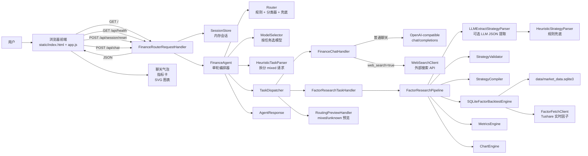

## 2. 启动流程

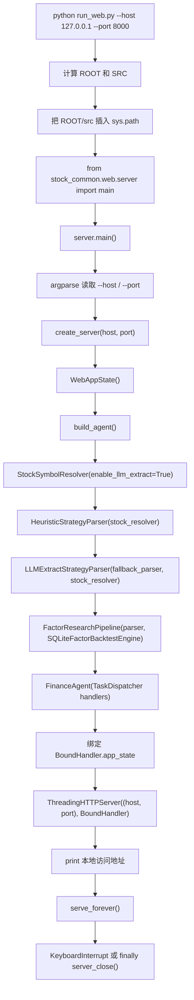

关键点：

- `run_web.py` 本身只负责路径和入口跳转。
- `server.build_agent()` 在 Web 启动时组装真实可用的处理器。
- Web 版 `TaskDispatcher` 明确覆盖四类路由：`chat`、`factor_research`、`mixed`、`unknown`。

## 3. 前端交互流程

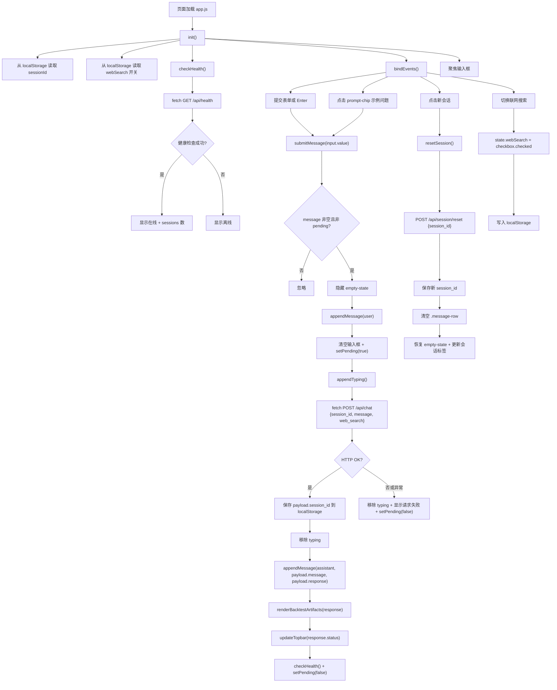

## 4. HTTP 接口分发

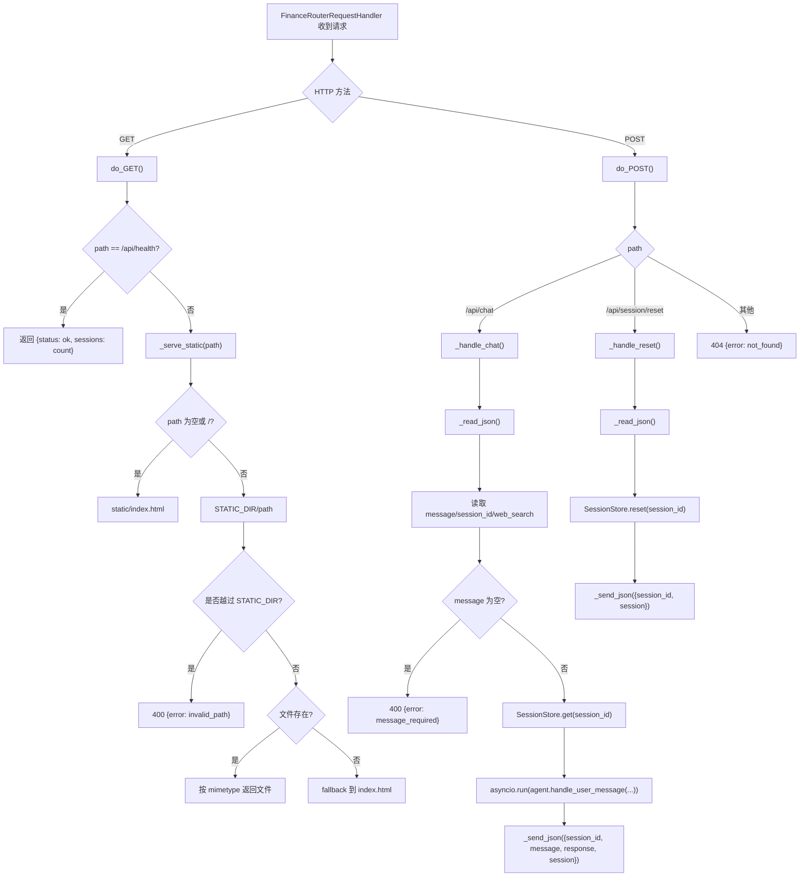

## 5. `/api/chat` 到 Agent 的单轮编排

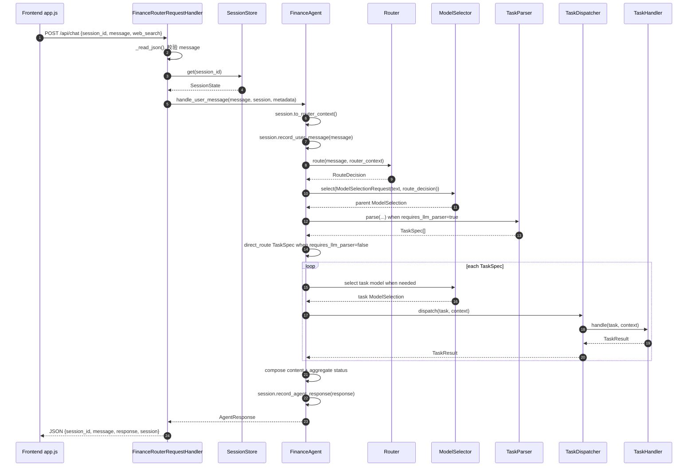

## 6. Router 决策细图

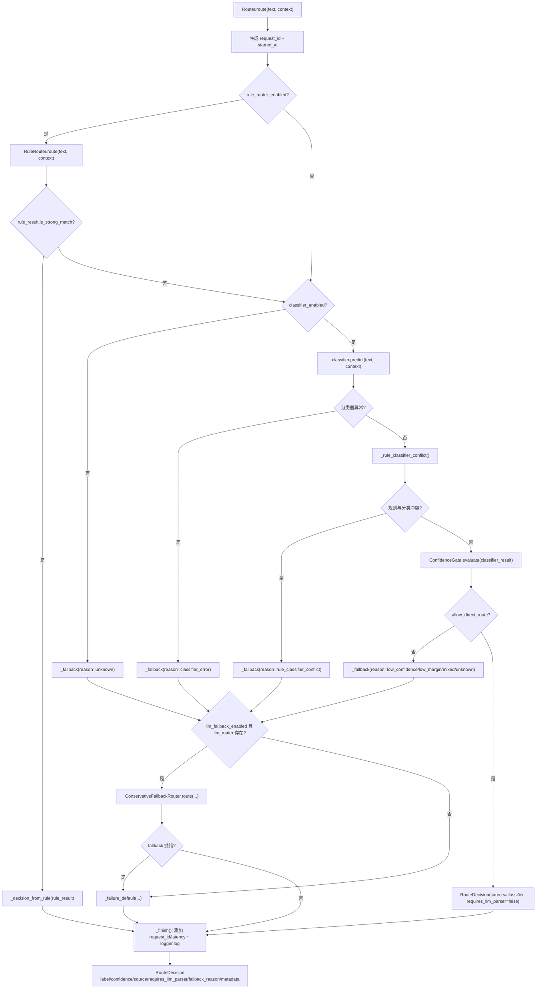

路由标签含义：

- `chat`：解释、问答、当前信息查询。
- `factor_research`：因子研究、策略回测、收益/风险表现验证。
- `mixed`：同一输入含多意图，后续要拆分成多个任务。
- `unknown`：当前无法可靠判断，需要用户补充。

## 7. 任务拆分与处理器分支

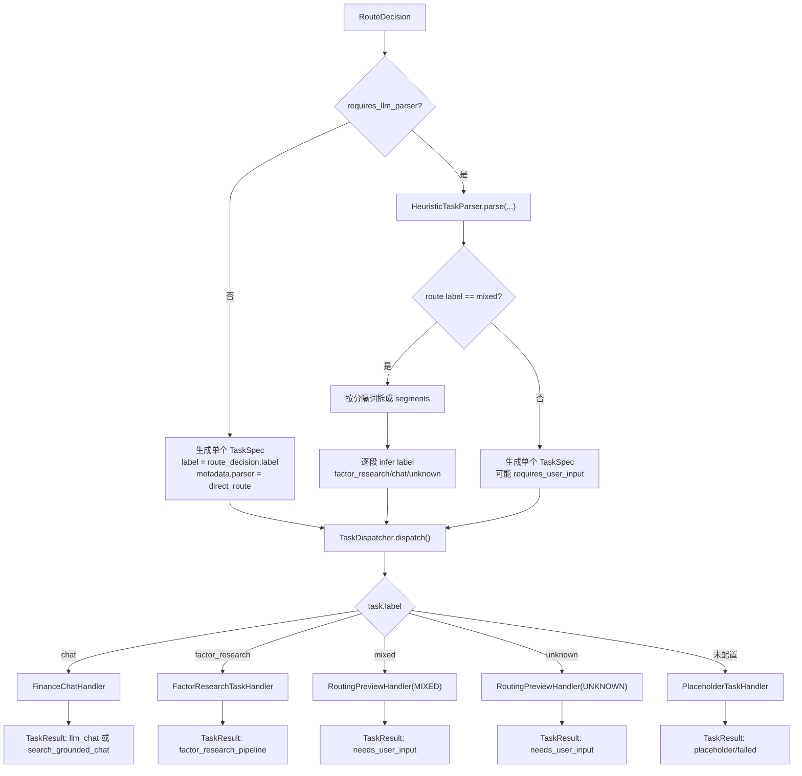

## 8. Chat 分支

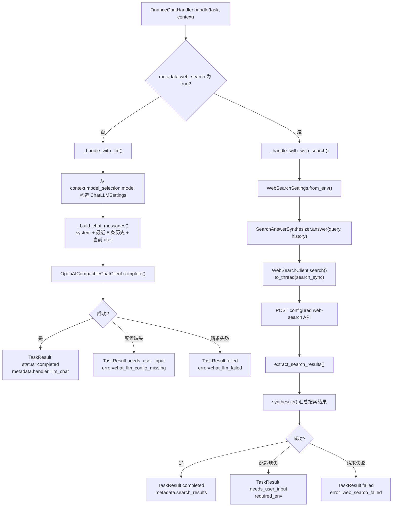

## 9. 因子研究与回测分支

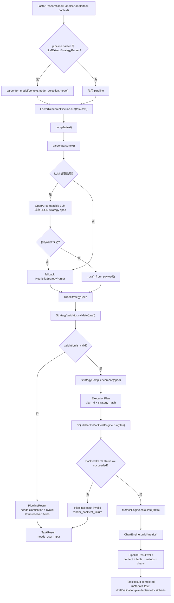

## 10. SQLite 回测引擎内部流程

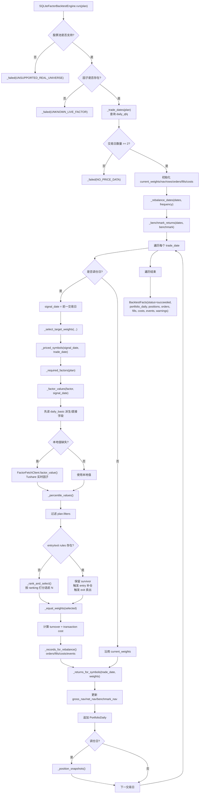

## 11. 响应数据和前端回测图表渲染

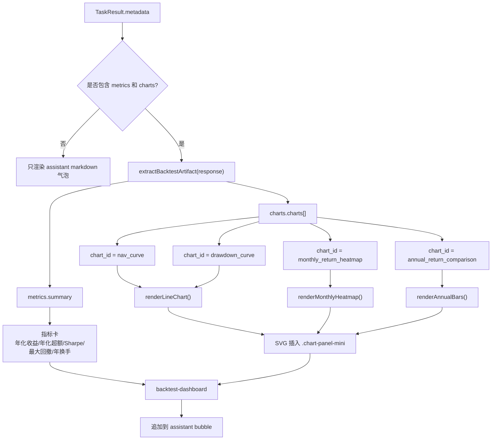

HTTP 响应结构：

```json
{
  "session_id": "session_xxx",
  "message": "AgentResponse.content",
  "response": {
    "content": "...",
    "status": "completed | needs_user_input | partial | failed",
    "route_decision": {},
    "model_selection": {},
    "tasks": [],
    "task_results": [],
    "metadata": {}
  },
  "session": {
    "session_id": "session_xxx",
    "previous_intent": "chat | factor_research | mixed | unknown",
    "conversation_summary": "...",
    "message_count": 2
  }
}
```

## 12. 会话状态流

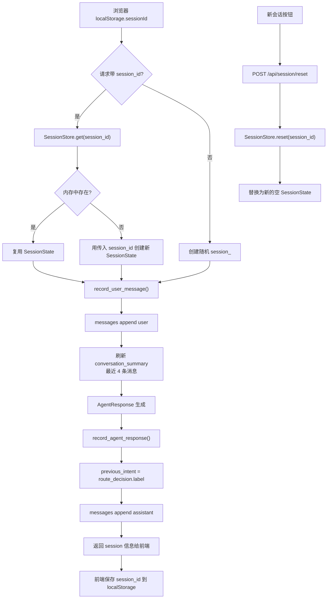

## 13. 主要异常与降级路径

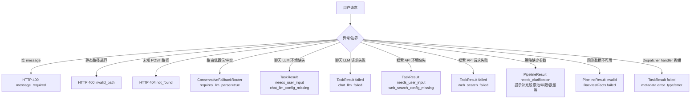

## 14. 运行时配置边界

| 能力 | 主要配置 | 使用位置 |
| --- | --- | --- |
| 普通聊天 LLM | `FINANCE_CHAT_*`，以及 fallback `DEEPSEEK_*` / `OPENAI_*` | `ChatLLMSettings.from_model_profile()` |
| 因子研究/任务解析 LLM | `FINANCE_RESEARCH_*` 或强模型配置 | `LLMExtractStrategyParser.for_model()` |
| 是否启用因子 LLM 抽取 | `FACTOR_RESEARCH_PARSER_MODE=llm/json/...` | `LLMExtractStrategyParser._is_enabled()` |
| 个股名称 LLM 抽取 | `STOCK_RESOLVER_LLM_MODE=on/llm/json/...` | `StockIdentityExtractor._is_enabled()` |
| 联网搜索 | `FINANCE_WEB_SEARCH_API_URL`、`FINANCE_WEB_SEARCH_API_KEY` 等 | `WebSearchSettings.from_env()` |
| 本地市场库 | `DATA_FETCH_DB_PATH`，默认 `data/market_data.sqlite3` | `DataFetchConfig.from_env()` |
| 实时因子 | `TUSHARE_TOKEN`、可选 `TUSHARE_HTTP_URL` | `FactorFetchClient` |

## 15. 源码索引

- `run_web.py`：入口，只设置 `src` 路径并调用 Web server `main()`。
- `src/stock_common/web/server.py`：HTTP 服务、session store、Agent 组装、静态资源和 API 分发。
- `src/stock_common/web/static/app.js`：前端状态、事件绑定、API 调用、Markdown/数学/回测图表渲染。
- `src/stock_common/web/handlers.py`：Web 侧 chat/search handler 和 mixed/unknown 预览 handler。
- `src/stock_common/agent/finance_agent.py`：路由、选模型、任务构建、dispatch、响应聚合。
- `src/stock_common/router/router.py`：规则、分类器、置信门控、fallback 的路由编排。
- `src/stock_common/agent/task_parser.py`：mixed 请求拆分和任务标签推断。
- `src/stock_common/backtest/pipeline.py`：自然语言策略到回测结果的端到端 pipeline。
- `src/stock_common/backtest/real_engine.py`：SQLite + Tushare 因子回测执行。
- `src/stock_common/backtest/metrics.py`：收益、风险、交易、稳定性等指标计算。
- `src/stock_common/backtest/charts.py`：图表数据 artifact 生成。
- `src/stock_common/search/web_search.py`：外部搜索 API 客户端。
- `src/stock_common/llm.py`：OpenAI-compatible chat-completions 客户端。
