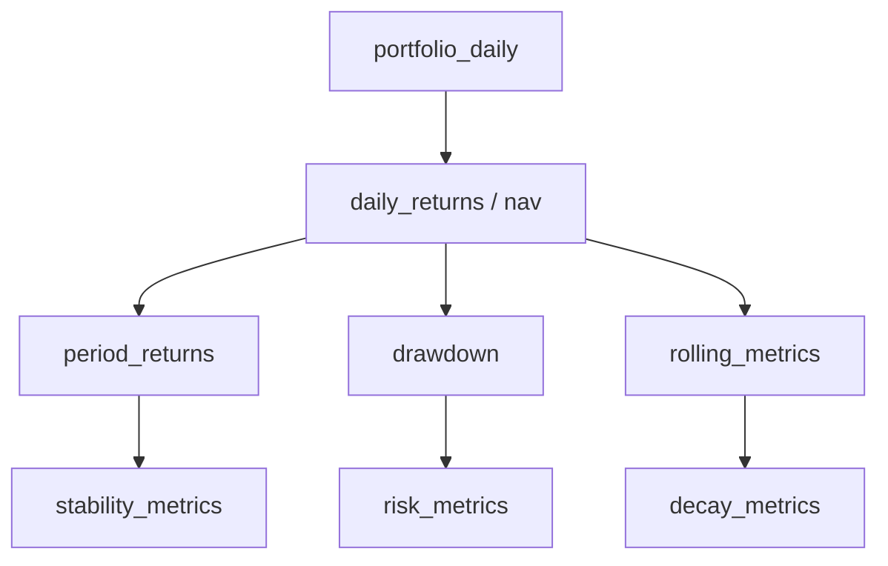

# Metrics Engine 设计规范

> 文档版本：v1.0  
> 输入：`BacktestFacts`  
> 输出：`MetricsResult`

## 1. 职责

Metrics Engine 按固定公式将回测事实转换为可评价、可绘图的指标，但不负责判断策略好坏。

负责：

- 收益、风险、基准、稳定性、交易、持仓和因子指标。
- 日、月、年和滚动时间序列。
- 指标依赖、最小样本量和缺失值处理。
- 对公式版本和计算警告进行记录。

不负责：

- 修改回测引擎的订单、成交和净值。
- 根据指标生成总分或评级。
- 生成自然语言投资建议。
- 依赖图表像素反向计算数值。

## 2. 输入契约

输入必须符合 `backtest_fact_contract.md`：

```python
class MetricsEngine:
    def calculate(
        self,
        facts: BacktestFacts,
        config: MetricsConfig,
    ) -> MetricsResult:
        ...
```

关键配置：

```json
{
  "metrics_version": "1.0.0",
  "annualization_factor": 252,
  "risk_free_rate_annual": 0.0,
  "rolling_windows": [63, 126, 252, 756],
  "var_confidence": 0.95,
  "minimum_samples": {
    "sharpe": 60,
    "beta": 60,
    "rolling_1y": 252,
    "icir": 12
  }
}
```

## 3. 输出结构

```json
{
  "schema_version": "1.0.0",
  "metrics_version": "1.0.0",
  "run_id": "bt_001",
  "summary": {
    "performance": {},
    "risk": {},
    "benchmark": {},
    "stability": {},
    "trading": {},
    "concentration": {},
    "factor": {}
  },
  "series": {
    "nav": [],
    "drawdown": [],
    "period_returns": [],
    "rolling_metrics": [],
    "turnover": [],
    "costs": [],
    "exposures": [],
    "factor_ic": []
  },
  "warnings": []
}
```

完整字段和公式以 `backtest_metrics.md` 为准。

## 4. 指标分组

| 组 | 核心指标 |
|---|---|
| `performance` | 累计收益、CAGR、基准收益、超额收益、Alpha |
| `risk` | 波动率、最大回撤、回撤时长、VaR、CVaR |
| `risk_adjusted` | Sharpe、Sortino、Calmar、Information Ratio |
| `stability` | 月/年胜率、滚动收益、滚动 Sharpe、分区间表现 |
| `trading` | 换手率、交易成本、拒单率、滑点、毛净收益差 |
| `concentration` | 持仓数、最大个股权重、Top10 权重、有效持仓数 |
| `factor` | 因子暴露、分组收益、IC、Rank IC、ICIR |
| `attribution` | 个股、行业和因子收益贡献 |

## 5. 计算 DAG

指标按依赖关系计算，禁止每个指标重复处理原始数据。



推荐计算顺序：

1. 校验输入和日期对齐。
2. 生成策略、基准和主动日收益。
3. 生成策略、基准和超额净值。
4. 生成回撤序列。
5. 聚合月度和年度收益。
6. 计算滚动指标。
7. 计算交易、成本、集中度和暴露指标。
8. 计算因子评价和收益归因。
9. 执行结果一致性校验。

## 6. 核心公式

### 6.1 净值

```text
strategy_nav[t] = cumulative_product(1 + net_return[t])
benchmark_nav[t] = cumulative_product(1 + benchmark_return[t])
excess_nav[t] = strategy_nav[t] / benchmark_nav[t]
```

### 6.2 年化收益

```text
years = calendar_days / 365.25
annual_return = (ending_nav / starting_nav) ^ (1 / years) - 1
```

### 6.3 波动率和 Sharpe

```text
annual_volatility = std(daily_return, ddof=1) × sqrt(252)

sharpe = mean(daily_return - daily_rf)
         / std(daily_return - daily_rf, ddof=1)
         × sqrt(252)
```

### 6.4 回撤

```text
running_peak[t] = max(nav[0:t])
drawdown[t] = nav[t] / running_peak[t] - 1
max_drawdown = min(drawdown)
```

### 6.5 主动风险

```text
active_return = strategy_return - benchmark_return
tracking_error = std(active_return, ddof=1) × sqrt(252)
information_ratio = mean(active_return) × 252 / tracking_error
```

### 6.6 有效持仓数量

```text
effective_holding_count = 1 / sum(position_weight²)
```

### 6.7 成本拖累

```text
transaction_cost_drag = gross_annual_return - net_annual_return
```

## 7. 缺失值与异常值

| 场景 | 处理规则 |
|---|---|
| 样本量不足 | 指标为 `null`，添加 `INSUFFICIENT_SAMPLE` |
| 分母为 0 | 指标为 `null`，添加 `ZERO_DENOMINATOR` |
| 日期不对齐 | 先按共同交易日对齐，记录丢弃数量 |
| 日收益小于等于 -100% | 视为严重异常或破产状态 |
| 暴露值缺失 | 不以 0 替代，记录覆盖率 |
| 无交易 | 换手和成本为 0，交易统计样本量为 0 |

禁止输出：

```text
NaN
Infinity
-Infinity
```

## 8. 指标计算接口

```python
class MetricCalculator(Protocol):
    name: str
    version: str
    required_inputs: set[str]

    def calculate(
        self,
        context: MetricContext,
    ) -> MetricOutput:
        ...
```

注册表示例：

```python
METRIC_REGISTRY = {
    "annual_return": AnnualReturnCalculator(),
    "max_drawdown": MaxDrawdownCalculator(),
    "sharpe_ratio": SharpeCalculator(),
    "annual_turnover": TurnoverCalculator(),
}
```

## 9. 第三方包使用原则

推荐：

- `pandas` / `numpy`：数据转换和基础公式。
- `scipy`：统计分布与检验。
- `quantstats`：开发阶段的指标交叉验证和快速 tear sheet。

生产指标必须以 `backtest_metrics.md` 的自有实现为标准答案。第三方包的无风险利率、年化、缺失值和周期胜率口径可能不同，不能直接替代内部协议。

## 10. 一致性检查

```text
ending_nav ≈ cumulative_product(1 + returns)[-1]
max(drawdown) <= 0
min(drawdown) == max_drawdown
gross_return >= net_return，在成本非负且无返佣模型时
sum(cost_components) ≈ total_transaction_cost
sum(weights) + cash_ratio ≈ 1
```

## 11. 缓存

缓存键至少包含：

```text
run_id
facts_checksum
metrics_version
metrics_config_hash
```

修改公式、窗口或无风险利率后必须使缓存失效。

## 12. 验收标准

- 每个指标都有名称、公式、输入依赖、最小样本量和版本。
- Summary 指标可以从 Series 复算。
- 相同输入和配置产生相同输出。
- 指标失败不会修改底层事实数据。
- 每个 `null` 指标都有对应警告或明确原因。
- 内部指标与独立参考实现处于规定误差范围内。

