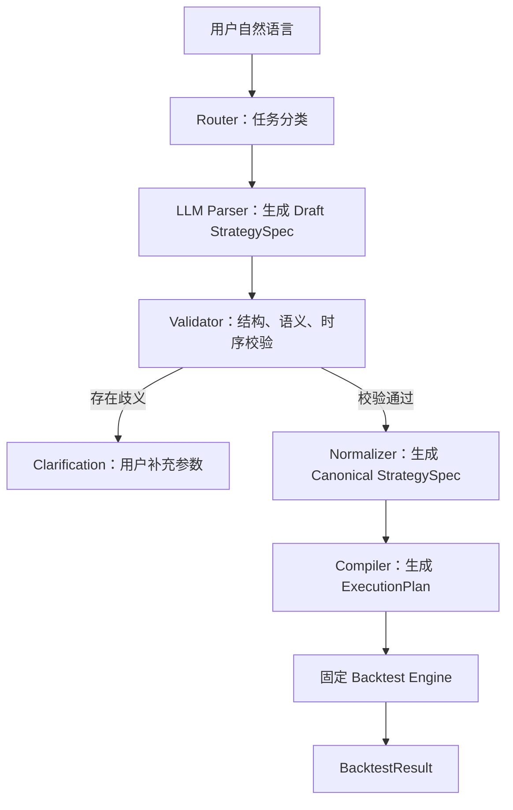
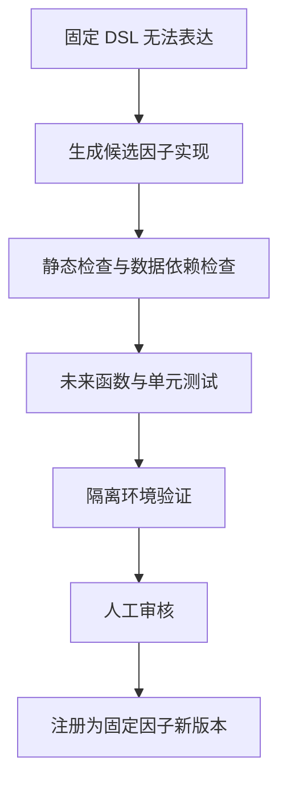

# 自然语言固定策略编译与确定性回测流程

> 文档版本：v1.0  
> 适用范围：自然语言选股策略、因子策略、固定规则回测  
> 相关规范：`router_design.md`、`backtest_metrics.md`

## 1. 文档目标

本文档定义如何把用户输入的自然语言固定策略，转换为可校验、可复现、可回测的确定性执行计划。

核心原则：

> LLM 负责理解自然语言，不直接生成或执行回测代码；Schema 限制表达范围，Validator 验证策略合法性，Compiler 生成固定执行计划，Backtest Engine 使用固定代码完成回测。

系统需要保证：

- 相同策略描述在规范化后得到相同的 `StrategySpec`。
- 相同 `StrategySpec`、数据版本和执行规则得到相同回测结果。
- 因子公式、操作符和交易规则来自固定注册表。
- 无法确认的策略参数不会被 LLM 静默猜测。
- 财务数据、行情数据和交易信号不存在未来函数。
- LLM 输出的任意代码不会直接进入生产回测。

---

## 2. 总体架构



完整数据流：

```text
UserInput
→ RouteResult
→ DraftStrategySpec
→ ValidationResult
→ CanonicalStrategySpec
→ ExecutionPlan
→ BacktestResult
→ Report
```

### 2.1 与 Router 的职责边界

Router 仅判断用户请求进入哪个工作流：

```text
chat
factor_research
mixed
unknown
```

Router 不负责：

- 解析 ROE 的计算公式。
- 决定因子字段名称。
- 生成回测代码。
- 查询市场或财务数据。
- 修改交易成本和成交模型。

当 Router 输出 `factor_research` 或需要回测的 `mixed` 请求时，才进入 Strategy Compiler 流程。

---

## 3. 为什么不让 LLM 每次生成回测代码

直接生成 Python 代码虽然灵活，但不适合作为固定策略主流程：

- 同一句自然语言可能生成不同代码。
- LLM 可能调用不存在的字段或函数。
- 可能绕过手续费、滑点、停牌和涨跌停限制。
- 可能错误使用财务报告期而不是公告日期。
- 很难对任意代码做完整的语义检查。
- 需要额外的安全沙箱和资源隔离。
- 很难保证不同策略采用相同的收益与风险口径。

推荐方式：

```text
自然语言
→ 受约束 JSON
→ 固定算子组合
→ 固定回测引擎
```

这里的“编译”主要指将结构化策略转换为内部执行计划，不一定生成 Python 源代码。

---

## 4. StrategySpec：策略中间表示

### 4.1 示例输入

```text
从沪深A股里选择ROE大于15%、市值最小的20只股票，
每月调仓，等权持有，单只股票亏损10%止损，回测过去十年。
```

### 4.2 Draft StrategySpec

LLM 只输出结构化解析结果：

```json
{
  "schema_version": "1.0.0",
  "status": "valid",
  "strategy": {
    "universe": {
      "market": "CN_A",
      "filters": [
        {
          "field": "listing_days",
          "operator": ">=",
          "value": 250
        },
        {
          "field": "is_st",
          "operator": "==",
          "value": false
        }
      ]
    },
    "signals": [
      {
        "factor": "roe_ttm",
        "operator": ">",
        "value": 0.15
      }
    ],
    "ranking": [
      {
        "factor": "market_cap",
        "direction": "asc",
        "weight": 1.0
      }
    ],
    "selection": {
      "method": "top_n",
      "count": 20
    },
    "portfolio": {
      "weighting": "equal_weight",
      "max_position_weight": 0.05
    },
    "rebalance": {
      "frequency": "monthly",
      "signal_at": "close",
      "trade_at": "next_open"
    },
    "exit_rules": [
      {
        "type": "stop_loss",
        "threshold": -0.10,
        "reference": "entry_price"
      }
    ],
    "backtest": {
      "lookback_years": 10,
      "benchmark": "000300.SH"
    }
  },
  "unresolved_fields": [],
  "assumptions": [],
  "field_confidence": {
    "signals[0].factor": 0.99,
    "ranking[0].direction": 0.98,
    "selection.count": 0.99
  }
}
```

### 4.3 固定状态

| 状态 | 含义 | 后续动作 |
|---|---|---|
| `valid` | 信息完整且通过解析检查 | 进入 Validator |
| `needs_clarification` | 缺少会显著影响结果的参数 | 要求用户补充 |
| `unsupported` | 超出因子或规则注册表能力 | 返回不支持项 |
| `invalid` | 条件冲突或无法构成有效策略 | 返回错误原因 |

### 4.4 不允许使用自由文本公式

不推荐：

```json
{
  "filter": "roe > 15% and market_cap is small"
}
```

推荐使用可校验表达式：

```json
{
  "type": "and",
  "children": [
    {
      "type": "comparison",
      "field": "roe_ttm",
      "operator": ">",
      "value": 0.15
    },
    {
      "type": "rank",
      "field": "market_cap",
      "direction": "asc",
      "top_n": 20
    }
  ]
}
```

---

## 5. 固定注册表

注册表是自然语言与确定性公式之间的边界。LLM 只能引用已注册能力。

### 5.1 因子注册表

```python
FACTOR_REGISTRY = {
    "roe_ttm": {
        "aliases": ["ROE", "净资产收益率", "滚动ROE", "高ROE"],
        "formula": "net_profit_ttm / average_equity_ttm",
        "dtype": "ratio",
        "direction": "higher_is_better",
        "available_from": "announce_date",
        "version": "1.0.0"
    },
    "market_cap": {
        "aliases": ["市值", "总市值", "小市值"],
        "formula": "close * total_shares",
        "dtype": "currency",
        "direction": "lower_is_better",
        "available_from": "trade_date",
        "version": "1.0.0"
    }
}
```

每个因子建议包含：

| 字段 | 说明 |
|---|---|
| `name` | 唯一因子名称 |
| `aliases` | 自然语言别名 |
| `formula` | 固定计算公式或函数标识 |
| `required_fields` | 原始数据依赖 |
| `dtype` | 比率、金额、布尔值、分类等 |
| `unit` | 小数、人民币元、交易日等 |
| `direction` | 越大越好或越小越好 |
| `available_from` | 数据可得时间规则 |
| `null_policy` | 缺失数据处理方式 |
| `winsorize_policy` | 去极值方法 |
| `version` | 公式版本 |

### 5.2 操作符注册表

```python
OPERATOR_REGISTRY = {
    "greater_than": ">",
    "greater_equal": ">=",
    "less_than": "<",
    "less_equal": "<=",
    "equal": "==",
    "between": "between",
    "in": "in",
    "top_n": "top_n",
    "bottom_n": "bottom_n"
}
```

### 5.3 交易规则注册表

```python
REBALANCE_REGISTRY = {
    "daily": "every_trade_day",
    "weekly": "last_trade_day_of_week",
    "monthly": "last_trade_day_of_month",
    "quarterly": "last_trade_day_of_quarter"
}

WEIGHTING_REGISTRY = {
    "equal_weight": "equal_weight_allocator",
    "market_cap_weight": "market_cap_allocator",
    "factor_weight": "factor_score_allocator"
}
```

未注册的因子或规则不得由 LLM 临时创造公式。

---

## 6. 校验流程

### 6.1 Schema 校验

验证 JSON 基础结构：

- 必填字段是否存在。
- 数据类型是否正确。
- 枚举值是否合法。
- 是否出现未定义字段。
- 是否符合当前 `schema_version`。

示例规则：

```text
selection.count > 0
0 < portfolio.max_position_weight <= 1
-1 < stop_loss.threshold < 0
ranking.direction ∈ {asc, desc}
```

Pydantic 建议禁止额外字段：

```python
from pydantic import BaseModel, ConfigDict

class StrictModel(BaseModel):
    model_config = ConfigDict(extra="forbid")
```

### 6.2 注册表校验

```text
factor ∈ FACTOR_REGISTRY
operator ∈ OPERATOR_REGISTRY
benchmark ∈ BENCHMARK_REGISTRY
weighting ∈ WEIGHTING_REGISTRY
exit_rule ∈ EXIT_RULE_REGISTRY
```

不支持项必须明确返回：

```json
{
  "status": "unsupported",
  "path": "signals[0].factor",
  "value": "management_sentiment",
  "message": "当前因子注册表中不存在该因子"
}
```

### 6.3 类型和单位校验

自然语言中的百分比必须转换为小数：

```text
ROE > 15%
→ value = 0.15
→ unit = ratio
```

字段类型与操作符需要匹配：

| 字段类型 | 合法操作 |
|---|---|
| 比率 | `>`, `<`, `between`, `rank` |
| 金额 | `>`, `<`, `between`, `rank` |
| 布尔值 | `==`, `!=` |
| 分类 | `in`, `not_in` |
| 日期 | `before`, `after`, `between` |

以下表达必须判定为非法：

```text
industry > 10
is_st rank ascending
ROE = 15亿元
```

### 6.4 语义一致性校验

检查策略内部是否自洽：

```text
ROE > 20% AND ROE < 10%        → 条件冲突
Top 0                           → 数量非法
开始日期 >= 结束日期            → 区间非法
日线数据 + 每分钟调仓            → 数据频率不支持
止损阈值为 +10%                 → 符号非法
```

仓位可行性检查：

```text
Top 20
单只股票最大权重 3%

最大股票仓位 = 20 × 3% = 60%
```

剩余 40% 必须明确进入现金，或者返回仓位约束冲突。

### 6.5 时间可得性校验

这是防止未来函数的核心校验：

```text
factor_available_time <= signal_generation_time
```

财务指标必须使用公告日期：

```text
报告期：2025-12-31
公告日：2026-03-25

最早可用时间：2026-03-25 公告发布之后
```

必须检查：

- 当日收盘产生的信号不能按当日收盘价成交。
- 财务指标只使用当时已经公告的数据。
- 使用历史时点指数成分股和行业分类。
- 使用历史 ST、停牌、上市和退市状态。
- 未来 N 日收益只能用于因子评价，不能用于选股。
- 因子标准化只能使用当期横截面数据。

### 6.6 执行可行性校验

固定执行政策至少覆盖：

- 涨停是否允许买入。
- 跌停是否允许卖出。
- 停牌如何处理。
- 成交量不足如何处理。
- 止损何时产生信号、何时成交。
- 调仓与止损同时触发时的优先级。
- 卖出后是否立即补位。
- 剩余现金如何处理。

示例：

```json
{
  "execution_policy": {
    "signal_at": "close",
    "trade_at": "next_open",
    "limit_up_buy": "reject",
    "limit_down_sell": "defer",
    "suspension": "hold",
    "insufficient_liquidity": "partial_fill"
  }
}
```

### 6.7 确定性校验

Canonical StrategySpec 生成稳定 Hash：

```text
strategy_hash = SHA256(
    canonical_strategy_spec
    + factor_registry_version
    + execution_policy_version
    + data_version
    + engine_version
)
```

必须满足：

```text
相同 Canonical StrategySpec
+ 相同公式版本
+ 相同数据版本
+ 相同执行规则
+ 相同随机种子
= 相同 BacktestResult
```

---

## 7. 缺失参数与澄清机制

### 7.1 字段级置信度

不要只返回整体置信度，应记录每个重要字段：

```json
{
  "status": "needs_clarification",
  "draft_spec": {},
  "unresolved_fields": [
    {
      "path": "selection.count",
      "reason": "用户只说选择少量股票，没有明确数量",
      "candidates": [10, 20, 30]
    }
  ],
  "assumptions": [],
  "field_confidence": {
    "ranking.factor": 0.99,
    "ranking.direction": 0.96,
    "selection.count": 0.31
  }
}
```

### 7.2 不应静默默认的参数

以下参数会显著改变回测结果，缺失时应澄清或明确展示默认值：

- 股票池。
- 回测区间。
- 因子定义，例如年度 ROE 或 ROE_TTM。
- 因子阈值。
- Top N 数量。
- 排名方向。
- 调仓频率。
- 权重方式。
- 成交时点。
- 止损基准。
- 比较基准。
- 交易成本和滑点模型。

可以固定为系统级默认的技术口径：

```text
收益率单位 = 小数
净值起点 = 1.0
年化交易日 = 252
无法计算的标量 = null
无数据序列 = []
```

---

## 8. Normalizer：策略规范化

Normalizer 将语义相同的表达转换为相同结构。

以下输入：

```text
ROE超过15%
净资产收益率大于15%
ROE > 0.15
```

统一转换为：

```json
{
  "factor": "roe_ttm",
  "operator": ">",
  "value": 0.15,
  "unit": "ratio"
}
```

规范化过程包括：

- 别名映射为注册表标准名称。
- 百分数转换为小数。
- 日期转换为 ISO 格式。
- 条件按照固定顺序排序。
- 缺省的技术参数补齐为系统默认值。
- 删除不影响语义的自然语言描述。
- JSON 字段使用稳定顺序和稳定序列化方式。

---

## 9. Compiler：生成 ExecutionPlan

Compiler 不修改用户策略，只负责把 Canonical StrategySpec 转为内部节点。

```python
ExecutionPlan(
    universe=UniverseNode(
        market="CN_A",
        listing_days_min=250,
        exclude_st=True
    ),
    filters=[
        FactorFilterNode(
            factor="roe_ttm",
            operator=">",
            value=0.15
        )
    ],
    ranking=[
        RankingNode(
            factor="market_cap",
            ascending=True
        )
    ],
    selection=TopNNode(count=20),
    weighting=EqualWeightNode(),
    rebalance=MonthlyRebalanceNode(),
    exits=[
        StopLossNode(
            threshold=-0.10,
            reference="entry_price"
        )
    ]
)
```

编译阶段需要解析：

- 每个因子对应哪个固定计算函数。
- 每个字段依赖哪些原始数据。
- 节点之间的依赖顺序。
- 信号时间和成交时间。
- 预估需要加载的数据区间。
- 是否可以复用已有的因子缓存。

---

## 10. 固定 Backtest Engine

回测引擎读取 ExecutionPlan，执行预先编写的代码。

```python
def run_backtest(
    strategy_spec: StrategySpec,
    data_version: str,
) -> BacktestResult:
    validated_spec = validator.validate(strategy_spec)
    canonical_spec = normalizer.normalize(validated_spec)
    execution_plan = compiler.compile(canonical_spec)

    return backtest_engine.run(
        plan=execution_plan,
        data_version=data_version,
    )
```

内部执行过程：

```python
universe = universe_engine.load(trade_date, plan.universe)

filtered = signal_engine.apply_filters(
    universe,
    plan.filters,
    trade_date,
)

ranked = signal_engine.apply_ranking(
    filtered,
    plan.ranking,
)

selected = portfolio_engine.select(
    ranked,
    plan.selection,
)

target_positions = portfolio_engine.allocate(
    selected,
    plan.weighting,
)

orders = execution_engine.generate_orders(
    current_positions,
    target_positions,
)

fills = execution_engine.execute(
    orders,
    market_state,
    plan.execution_policy,
)

accounting_engine.update(fills)
```

确定性回测表示执行固定代码，而不是每次生成一段新代码。

---

## 11. 反向描述与用户确认

StrategySpec 校验通过后，由固定模板生成策略说明：

```text
在全部A股中，剔除上市不足250日和ST股票；
保留ROE_TTM大于15%的股票；
按总市值从小到大排序，选择前20只并等权持有；
每月最后一个交易日收盘生成信号，下一交易日开盘成交；
相对入场复权价格亏损10%时，在下一可交易时点止损。
```

反向描述必须由模板生成，不能再次让 LLM 自由解释。

```text
原始自然语言
→ StrategySpec
→ 固定模板自然语言
→ 用户确认
```

如果反向描述与用户原始意图明显不同，策略不得进入正式回测。

---

## 12. 推荐工程结构

```text
financial_agent/
├── router/
│   ├── classifier.py
│   └── route_schema.py
│
├── strategy_parser/
│   ├── llm_parser.py
│   ├── prompts.py
│   └── parse_result.py
│
├── strategy_schema/
│   ├── strategy_spec.py
│   ├── expression_ast.py
│   └── validation_result.py
│
├── registry/
│   ├── factor_registry.py
│   ├── operator_registry.py
│   ├── benchmark_registry.py
│   ├── weighting_registry.py
│   └── execution_policy_registry.py
│
├── compiler/
│   ├── validator.py
│   ├── temporal_validator.py
│   ├── normalizer.py
│   ├── plan_builder.py
│   └── strategy_hash.py
│
├── engine/
│   ├── universe_engine.py
│   ├── factor_engine.py
│   ├── signal_engine.py
│   ├── portfolio_engine.py
│   ├── execution_engine.py
│   ├── accounting_engine.py
│   └── backtest_engine.py
│
├── metrics/
│   ├── performance.py
│   ├── risk.py
│   ├── trading.py
│   ├── factor_analysis.py
│   └── attribution.py
│
└── tests/
    ├── golden_cases/
    ├── test_parser.py
    ├── test_validator.py
    ├── test_compiler.py
    ├── test_no_lookahead.py
    └── test_reproducibility.py
```

---

## 13. 模块接口建议

### 13.1 Parser

```python
class StrategyParser:
    def parse(
        self,
        user_input: str,
        capabilities: CapabilitySummary,
    ) -> DraftStrategySpec:
        ...
```

### 13.2 Validator

```python
class StrategyValidator:
    def validate(
        self,
        draft: DraftStrategySpec,
    ) -> ValidationResult:
        ...
```

### 13.3 Normalizer

```python
class StrategyNormalizer:
    def normalize(
        self,
        spec: StrategySpec,
    ) -> CanonicalStrategySpec:
        ...
```

### 13.4 Compiler

```python
class StrategyCompiler:
    def compile(
        self,
        spec: CanonicalStrategySpec,
    ) -> ExecutionPlan:
        ...
```

### 13.5 Engine

```python
class BacktestEngine:
    def run(
        self,
        plan: ExecutionPlan,
        data_version: str,
    ) -> BacktestResult:
        ...
```

---

## 14. 测试体系

### 14.1 Golden Case

维护固定自然语言与期望 StrategySpec：

```yaml
input: 选择ROE最高、市值最小的20只股票，每月调仓
expected:
  ranking:
    - factor: roe_ttm
      direction: desc
    - factor: market_cap
      direction: asc
  selection:
    method: top_n
    count: 20
  rebalance:
    frequency: monthly
```

每次修改 Prompt、模型、Schema 或注册表后重新运行。

### 14.2 等价表达测试

以下输入应得到相同 Canonical StrategySpec：

```text
ROE超过15%
净资产收益率大于15%
ROE > 0.15
```

最终 `strategy_hash` 应一致。

### 14.3 Property-Based Test

自动生成策略参数并检查不变量：

```text
-1 < stop_loss < 0
top_n > 0
sum(target_weights) <= 1
start_date < end_date
drawdown <= 0
NAV 不包含 NaN 或 Infinity
```

### 14.4 对抗输入测试

```text
选一些好公司
使用未来一年收益最高的股票
ROE大于20%同时小于10%
每月调仓但每天重新选股
无论是否成交都按涨停价买入
```

系统目标不是强行生成策略，而是正确返回：

```text
needs_clarification
unsupported
invalid
```

### 14.5 可复现性测试

对相同输入重复执行两次，检查：

```text
canonical_strategy_spec_1 == canonical_strategy_spec_2
strategy_hash_1 == strategy_hash_2
execution_plan_1 == execution_plan_2
backtest_result_1 == backtest_result_2
```

---

## 15. 自定义策略扩展流程

只有当注册表和 StrategySpec 无法表达用户逻辑时，才进入代码扩展流程。

例如：

```text
ROE连续三年增长，并且增长速度相对行业中位数呈二阶加速。
```

处理流程：



生成代码用于扩展引擎，而不是用于每次执行回测。

新因子进入生产环境前必须具备：

- 唯一因子名称。
- 固定公式和数据依赖。
- 数据可得时间规则。
- 缺失值和异常值策略。
- 单元测试与防未来函数测试。
- 公式版本号。
- 与自然语言别名的映射。

---

## 16. 第一版实现范围

建议第一版只支持有限但明确的能力。

### P0

- 股票池：全 A 股、沪深300、中证500。
- 因子：ROE_TTM、市值、PE_TTM、PB、过去 N 日收益率。
- 条件：大于、小于、区间、Top N、Bottom N。
- 排序：单因子升序和降序。
- 权重：等权。
- 调仓：周度、月度、季度。
- 成交：收盘产生信号、下一交易日开盘成交。
- 成本：佣金、印花税、固定 bps 滑点。
- 退出：调仓卖出和固定比例止损。

### P1

- 多因子线性打分。
- 行业中性化。
- 最大行业权重和最大个股权重。
- 波动率倒数权重。
- 止盈、移动止损和持有期退出。
- 多基准对比。

### 暂不支持

- 用户任意 Python 代码直接执行。
- 盘中高频策略。
- 任意自然语言自定义公式。
- 未注册的另类数据因子。
- 无法确定数据可得时间的财务指标。

---

## 17. 验收标准

该流程达到以下条件即可进入第一版开发验收：

- LLM 只输出符合 Schema 的 Draft StrategySpec。
- 不支持字段会被注册表校验明确拒绝。
- 重要参数缺失时返回 `needs_clarification`。
- 语义冲突策略不会进入编译阶段。
- 财务因子按照公告日期提供给策略。
- 当日收盘产生的信号不会按当日收盘成交。
- 等价自然语言可以生成相同 Canonical StrategySpec。
- StrategySpec 可以稳定生成 ExecutionPlan 和 `strategy_hash`。
- 相同输入、版本和随机种子得到相同 BacktestResult。
- 回测指标满足 `backtest_metrics.md` 的字段和计算口径。
- LLM 生成的任意源代码不会直接进入生产回测。

---

## 18. 核心结论

推荐的最终链路是：

```text
自然语言
→ LLM 解析 Draft StrategySpec
→ Schema 与注册表校验
→ 语义、时序和成交校验
→ Canonical StrategySpec
→ ExecutionPlan
→ 固定 Python Backtest Engine
→ BacktestResult
```

职责总结：

| 模块 | 核心职责 |
|---|---|
| LLM Parser | 把自然语言转换为候选结构 |
| Schema | 限制系统允许表达的策略范围 |
| Validator | 证明策略结构、语义、时序和执行规则合法 |
| Normalizer | 把等价表达转换为统一形式 |
| Compiler | 把策略结构装配为固定执行计划 |
| Backtest Engine | 执行固定代码并产生唯一结果 |
| Metrics Engine | 按统一协议计算收益、风险和归因指标 |

因此，确定性回测并不是每次生成新代码进行测试，而是让经过校验的策略配置驱动一套版本化、可测试、可复现的固定回测程序。

